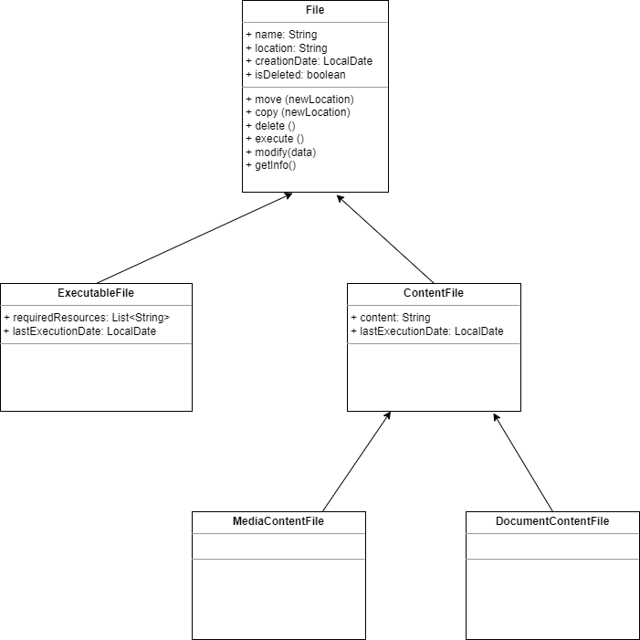

# Task 0
Create a Book store program. In the store we can have only one book from the same type.( Same type means book with same author, title and year). Our programm should implement all method from Store interface. 
```
public interface Store {

  /**
   * Add book to the store
   * @param o is the book which we want to add
   * @return true is the book is add successful and false is the book is already exists
   */
  boolean add(Book o);

  /**
   * Remove specific book from the store
   * @param o is the book which we want to remove
   */
  void remove(Book o);

  /**
   *  Get all books by Author
   * @param author
   * @return
   */
  List<Book> getAllBooksByAuthor(String author);

  /**
   * Get all books publish after specific year
   * @param from
   * @return
   */
  List<Book> getAllBooksPublishedAfter(LocalDate from);

  /**
   * Return all books between two dates
   * @param from
   * @param to
   * @return
   */
  List<Book> getAllBooksBetween(LocalDate from, LocalDate to);

  /**
   * Clear the whole book store
   */
  void clear();

  /**
   * Return all books grouped by author
   * @return
   */
  Map<String, List<Book>> getAllBooksGroupByAuthor();


  /**
   * Return all books grouped by publisher
   * @return
   */
  Map<String, List<Book>> getAllBooksGroupByPublisher();

  /**
   * Filter books by given filter
   * @param bookPredicate
   * @return
   */
  List<Book> getAllBooksFilterBy(Predicate<Book> bookPredicate);

}
```
Also, we have class Book:
```
public class Book {
  private String title;
  private String author;
  private BigDecimal price;
  private String publisher;
  private LocalDate publishedYear;
}
```
As a part of this task you should choose the correct collection. 

# Task 1

Create FileManagement system with the following structure. 
File is an abstract class


Create class FileManagement which reads rows for standard input(TIP: Use Scanner class [here](https://www.geeksforgeeks.org/scanner-class-in-java/)) until "END". The class should implement the following commands:
* MAKE - create a file. Rules: if the forth argument of the input command is *CONTENT* we need to create ContentFile Object. If the name ends with '.avi' or '.mp3' we need to create a 'MediaContentFile'. In all other cases create DocumentContentFile.
* MOVE - move file to a new location
* MOD - modify the content of the specific file
* COPY - copy file 
* DEL - remove the file
* EXEC - execute executable file. Print in the standard output ```Executing [[executableFileName]]```
* INFO - get full information about the file. To visualize information of the file follow the pattern: 
```
Name: <location>/<name> [[DELETED]]
Creation date: <creation date>
Last <modification|execution> date: <last modification|execution date>
```
  where DELETED is shown if the file was deleted. If the file is executable we have additional row
```
Required resources:
<resource name 1>
<resource name 2> …
<resource name N>
```

```
Example input:
MAKE <name><location> CONTENT=<content of the file>
MAKE <name><location> [<resuource 1>,<resuource 2>, ... <resuource 1> n ]
MOVE <name><location>
MOD <name><new content>
COPY <name><location>
DEL <name>
EXEC <name>
INFO <name>
END
```
