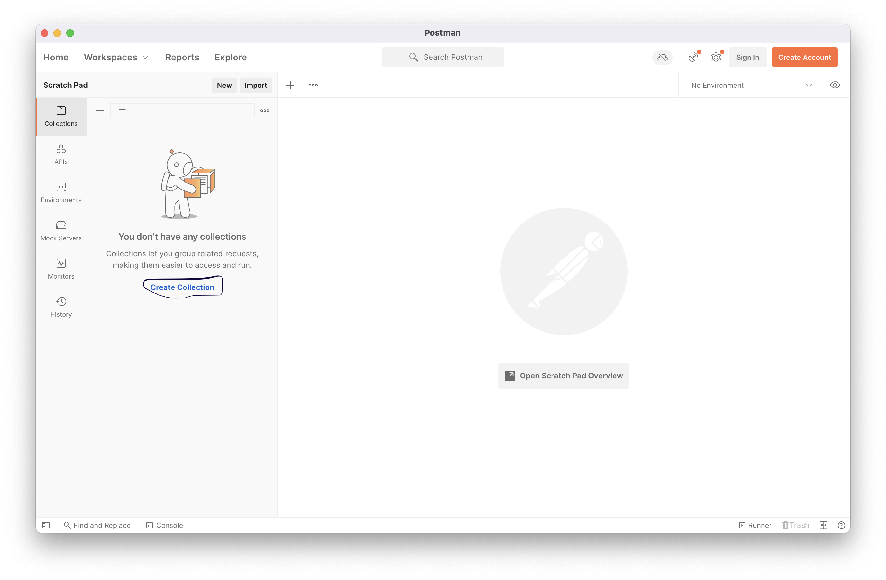
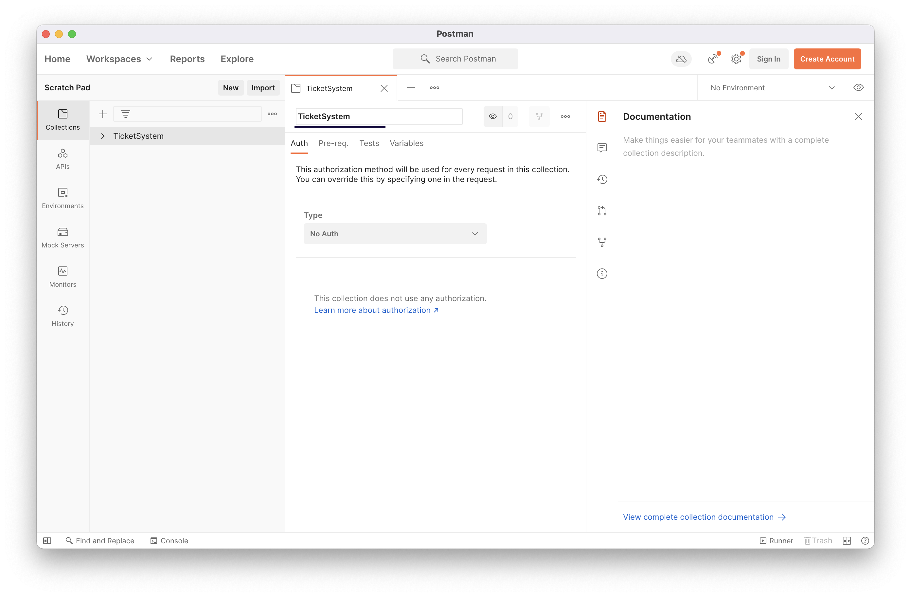
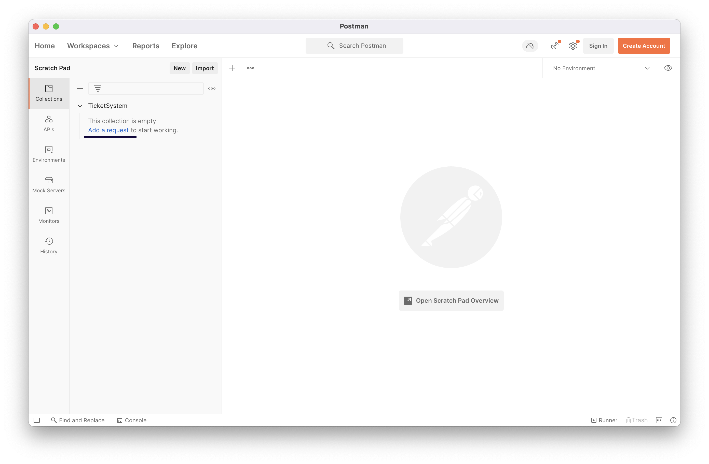
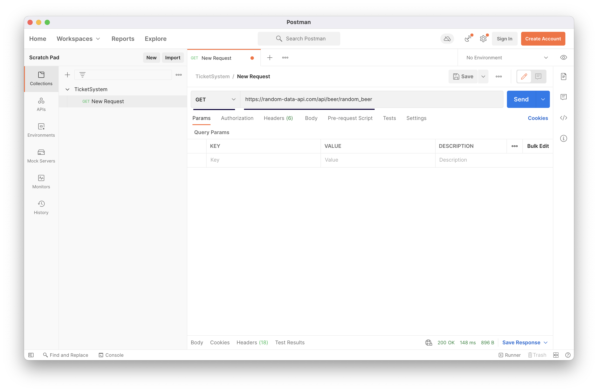

For all your tasks use your Ticket system project from week05

# Task 00
*To call REST endpoitns we will use Postman tool.*

Download from **[here](https://www.postman.com/downloads/)**

Consume data from random-data-api API about beer information. 
Additional information about the RDA API [project](https://random-data-api.com/documentation)

How to setup a call
1. Create collection - this will hold all your requests
   
   
2. Add new request inside collection - this will be your HTTP request
   
3. Set URL -> https://random-data-api.com/api/beer/random_beer
4. Set HTTP method -> GET
   
5. If you have parameters or body enter them here. For our case we do not have any
6. Click on 'Send' and see the result
   

# Task 01 - Defining controllers in the Ticket system
In the next task we will use our ongoing Ticket system. (you can use implementation from this [repo](https://github.com/GeorgiMinkov/web-development-with-Java/tree/main/week05/solution/theaterticketsystem) {pay attantion: ticket service is not implement})

***NB:*** *DTO* pattern and *Mappers* will be discussed in depth inside the next lecture

## Part 01 - Create dummy controller - together
0. Delete the CommandLineRunner from your project
1. Add spring boot starter web dependency inside pom.xml (refresh maven to fetch your new dependency)
2. Create package controller in which you will add your files.
3. Create file DummyController
4. Annotate it with @RestController - this will tell Spring that this will be REST controller and will be accessable over the HTTP and with @RequestMapping("/dummy") - thiw will say what is the base path
5. Create a simple public method that will return String value
6. Annotate it with @GetMapping("/hello-world") - this will say, create an endpoint which will be accesable over HTTP GET method with path /hello-world (using the base above /dummy/hello-world)
7. Create an endpoint which will recieve a path variable and return some String value
8. Create an endpoint which will recieve a @RequestBody with a POST method
9. Call every endpoint from Postman

## Part 02
1. Expose every functionality from the User service as web REST endpoint.
   In the next points we will define steps for shaping the REST endpoint
   - first we need to define structure for our REST API
     - path -> localhost:8080/users
   - createUser - as the name says we need to create user inside our "DB".
     - path -> localhost:8080/users
     - HTTP method -> POST (we will create a new user)
     - HTTP body -> JSON formatted payload
        ```
        {
            userName: "zeee",
            email: "zee@test.test"
        }
        ```
      - Returned Code 201 (Created)
    - findById - find a specific user by provided id
      - path -> localhost:8080/users/{userId}
      - HTTP method -> GET (we will get information of an user)
      - Path variable -> localhost
      - Returned Code 200 OK
    - deleteUser - same tactics from above but use the appropriate HTTP method
5. For workout expose every functionality for Tickets and Events

## Task 02
Find a way to change the default port of your Spring Boot application

